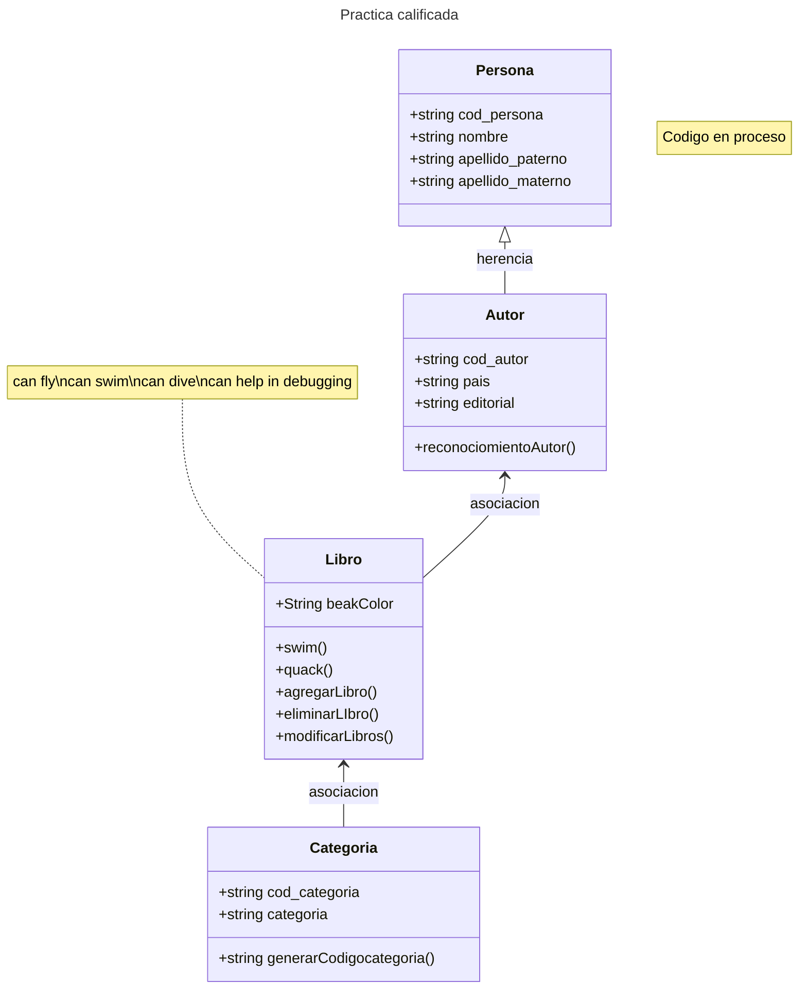

```mermaid
---
title: Practica calificada
---
classDiagram
    note "Codigo en proceso"


    Autor <-- Libro : asociacion
    Libro <-- Categoria : asociacion
    note for Libro "can fly\ncan swim\ncan dive\ncan help in debugging"
    Persona <|-- Autor : herencia
    
   

    class Persona{
        +string cod_persona
        +string nombre
        +string apellido_paterno
        +string apellido_materno
    }
    class Libro{
        +String beakColor
        +swim()
        +quack()
        +agregarLibro()
        +eliminarLIbro()
        +modificarLibros()
    }
    class Autor{
        +string cod_autor
        +string pais
        +string editorial
        +reconociomientoAutor()

    }
    class Categoria{
        +string cod_categoria
        +string categoria
        +string generarCodigocategoria()
    }

```